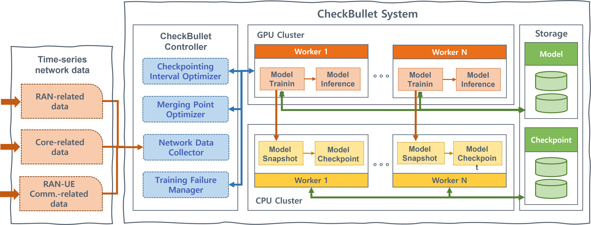

# CheckBullet

## Introduction
CheckBullet is a lightweight checkpoint system that minimizes storage requirements and enables fast recovery in mobile networks.

CheckBullet architecture has four major components: 1) CheckBullet controller (CC), 2) GPU cluster, 3) CPU cluster, and 4) Storage as shown in the figure below.


## Requirements
We recommend the following specifications.

1. Python 3.5.x  [Link](https://www.python.org/downloads/)
2. TensorFlow 1.10.0 [Link](https://www.tensorflow.org/install)

CheckBullet requires an NVIDIA GPU with CUDA 9.0, CUDNN 7.0, and Python 3.5.x.
CheckBullet operates based on the Tensorflow library and performs training on time-series data generated from mobile networks.

## How to run
CheckBullet is implemented as an extendible module for Tensorflow.

1. Import CheckBullet controller and checkpoint in the training callbacks
```
from cb_controller.Controller import controller
from cb_checkpoint.Checkpoint import checkpoint
```

2. Set model configuration parameters for a model

2. Run CheckBullet training
```
python training.py
```
